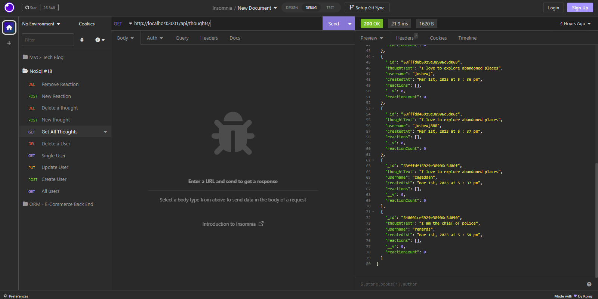

# NoSql: Social Network API

<br>

**NoSql: Social Network API** is an application built using JS, Json, insomnia, prettier, express node.js, mongodb and mogoose.

<br>

## Images of the completed app:
***

<br>

## All Users


<br>

## Create A User

<br>

## Update A User


<br>

## Delete A User


<br>

## Get All Thoughts


<br>

## Add A New Thought


<br>

## Update A Thought


<br>

## Delete A Thought


<br>

## Add A New Reaction


<br>

## Remove A Reaction


<br>

```md
AS A social media startup
I WANT an API for my social network that uses a NoSQL database
SO THAT my website can handle large amounts of unstructured data
```

<br>

## Acceptance Criteria

```md
GIVEN a social network API
WHEN I enter the command to invoke the application
THEN my server is started and the Mongoose models are synced to the MongoDB database
WHEN I open API GET routes in Insomnia for users and thoughts
THEN the data for each of these routes is displayed in a formatted JSON
WHEN I test API POST, PUT, and DELETE routes in Insomnia
THEN I am able to successfully create, update, and delete users and thoughts in my database
WHEN I test API POST and DELETE routes in Insomnia
THEN I am able to successfully create and delete reactions to thoughts and add and remove friends to a user’s friend list
```
 
 <br>

  ## Features
  ***
  
  Features of the deployed application and repository are as follows:

<br>

  ## TECHNOLOGY USED
  ***
    JS 
    Json 
    express 
    node.js
    insomnia
    Mongodb
    Mongoose
    prettier
 
 <br>

## THE VIDEO WALKTHROUGH CAN BE FOUND AT THE FOLLOWING URL:
***

<br>

[Click Here](https://drive.google.com/file/d/1aa7INWAOMjXZ-BedVbyzs2_zE899CUeM/view)

<br>

  ## INSTALLATION OF THE REPO FROM GITHUB
  ***
  A copy of the repository can be cloned at [Click Here](https://github.com/Lycanchic/nosql-social-network-api)
    * Simply click on the repo and select **Clone**. 
    * From the drop down menu select the copy icon. Type (directly into your terminal):

    ```
    'git clone' + 'the repo link' + enter.
    ``` 
<br>

- - -
© 2022 Trilogy Education Services, LLC, a 2U, Inc. brand. Confidential and Proprietary. All Rights Reserved.